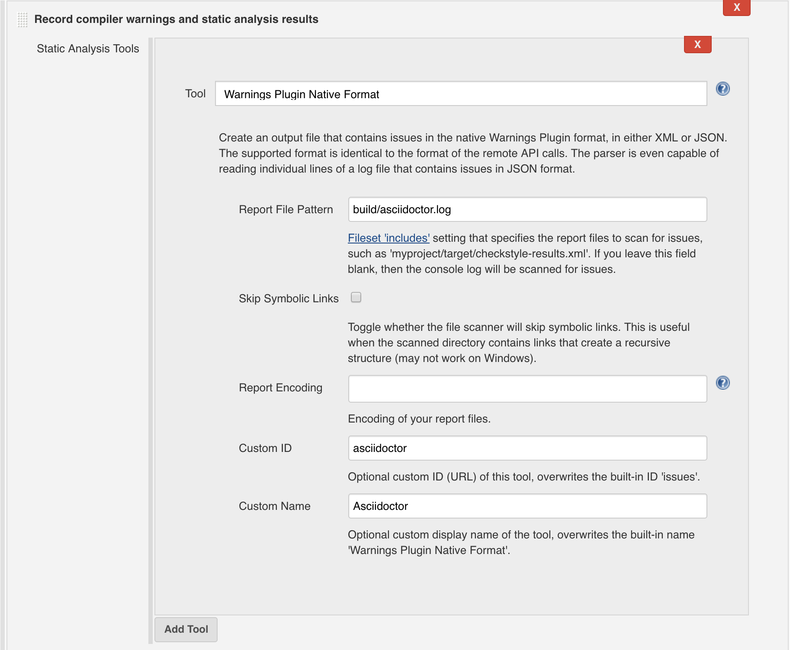

:rootdir: ../../..
:github-readme: {rootdir}/README.adoc
:srcdir: {rootdir}/src/
:listing-caption: Listing
:revdate: {project-builddate}
:revnumber: {project-version}

include::{github-readme}[tags=vardef]

:projectpage: https://github.com/{gh-repo-owner}/{gh-repo-name}

include::{github-readme}[tags=header]

== URLs

* link:{homepage}[Project home] (this page)
* link:{projectpage}[GitHub project]
* link:{issues}[Issue tracker]

TIP: Do you want to improve this page? Please git-link:self[edit it on GitHub, edit].

== Description

When AsciidoctorJ converts a document, it writes issues to the console (malformed AsciiDoc constructs, missing attribute, errors…).
This extension collect those issues and to write them into a single log file: `build/asciidoctor.log`.
This file can be then used by other tools.
For example the Jenkins link:https://wiki.jenkins.io/x/1YTeCQ[Warnings Next Generation Plugin], can collect the asciidoctor issues in order to display them as part of the job result.

=== AsciidoctorJ version

This extension is compatible with `org.asciidoctor:asciidoctorj` in range `{asciidoctorj-version}`.

The continuous integration server runs the test suite with different AsciidoctorJ versions within this range.

== Usage

The extension is published on maven central and can be directly consumed from a gradle build.

include::{rootdir}/usage/gradle-example/README.adoc[leveloffset=1, tags=gradle-integration]

For a complete example, see: git-link:usage/gradle-example/build.gradle[build.gradle, branch="master"]

=== Output example

The content of the `build/asciidoc.adoc` example can look like this:

.Example content for the log file
----
include::{rootdir}/src/test/resources/example-log.txt[]
----

=== Integration with Jenkins

You need to install the link:https://wiki.jenkins.io/x/1YTeCQ[Warnings Next Generation Plugin] (tested with version `5.3.0`).

In your build configuration, in the "Post-build Actions" section, add a "Record compiler warnings and static analysis results" item:

Configure the item with following values:

* Tool: `Warnings Plugin Native Format`
** Report File Pattern: `build/asciidoctor.log`
** Custom ID: `asciidoctor` (optional)
** Custom Name: `Asciidoctor Logs` (optional)

Here the same configuration as Jenkins pipeline script:

.Jenkins pipeline configuration
----
recordIssues(tools: [issues(id: 'asciidoctor', name: 'Asciidoctor Logs', pattern: 'build/asciidoctor.log')])
----

== Download

The library is hosted on maven central.

[source, xml, subs="verbatim,attributes"]
.Maven coordinates of the library
----
<dependency>
  <groupId>fr.jmini.asciidoctorj</groupId>
  <artifactId>file-logger</artifactId>
  <version>{last-stable-version}</version>
</dependency>
----

== Source Code

As for any grade plugin, the source code of the plugin is available in the git-link:src/[src/] folder.

=== Build

This project is using gradle.

Command to build the sources locally:

----
./gradlew build
----

Command to deploy to your local maven repository:

----
./gradlew publishToMavenLocal
----

Command to build the documentation page:

----
./gradlew asciidoctor
----

The output of this command is an HTML page located at `<git repo root>/build/docs/html5/index.html`.

==== For project maintainers

`signing.gnupg.keyName` and `signing.gnupg.passphrase` are expected to be set in your local `gradle.properties` file to be able to sign.
`sonatypeUser` and `sonatypePassword` are expected to be set in order to be able to publish to a distant repository.

Command to build and publish the result to maven central:

----
./gradlew publishToNexus
----

Command to upload the documentation page on GitHub pages:

----
./gradlew gitPublishPush
----

Command to perform a release:

----
./gradlew release -Prelease.useAutomaticVersion=true
----

==== Using ssh-agent

Some tasks requires pushing into the distant git repository (release task or updating the `gh-pages` branch).
If they are failing with errors like this:
----
org.eclipse.jgit.api.errors.TransportException: ... Permission denied (publickey).
---- 

Then `ssh-agent` can be used.
----
eval `ssh-agent -s`
ssh-add ~/.ssh/id_rsa
----
(link:https://superuser.com/a/990447/[source] for this approach)

include::{github-readme}[tags=contact-section]

include::{github-readme}[tags=license-section]

